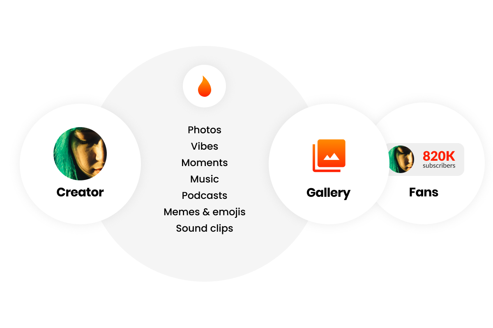

A **Mesi Gallery** is a creator's centralized hub for all digital assets. Unlike traditional social media profiles, Mesi Galleries act as permanent digital portfolios, meticulously organized by media type and ownership history.

  
  

## Organized Content Discovery

Every gallery is automatically partitioned into three primary sections to ensure a seamless fan experience:
* **Photo Galleries:** High-fidelity images, digital art, and photography.
* **Video Galleries:** Cinematic content and short-form clips.
* **Audio Galleries:** Music, podcasts, and soundscapes.

<Frame caption="The Mesi Gallery Architecture">
  
</Frame>

### Key Management Features
* **Rights Verification:** Upon upload, creators must confirm their legal rights to the assets.
* **Chronological Display:** Content is displayed in a default chronological timeline of creation.
* **Smart Filtering:** Fans can sort and filter content by media type, year of release, and custom tags.

---

## Gallery Completeness & Capacity

Mesi Galleries are designed for permanence and infinite scale, providing a complete record of a creator's professional history.

<CardGroup cols={2}>
  <Card title="Permanent Showcase" icon="infinity">
    Galleries display **all content** a creator has ever uploaded—even after an NFT is sold to another user. This ensures your public portfolio remains complete.
  </Card>
  <Card title="Unlimited Storage" icon="database">
    There are no limits on gallery size. Creators can upload as much content as they need to build their brand without worrying about storage caps.
  </Card>
</CardGroup>

<Frame>
  
</Frame>

<Info>
  **Note on Ownership:** While sold items remain visible in your gallery for portfolio purposes, they are clearly marked to distinguish them from items still available for purchase.
</Info>
