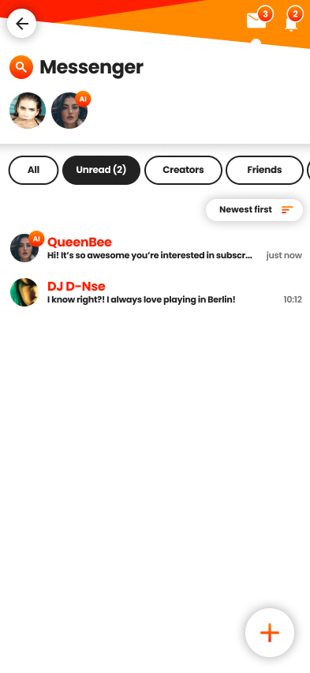

Mesi provides a suite of dynamic tools that allow creators to pivot instantly between public broadcasting and high-value private interactions.

## Live Stream Modes

Creators can host video or audio streams in four distinct formats to suit their community and monetization goals.

<CardGroup cols={2}>
  <Card title="Public Session" icon="globe">
    Visible in the global "Live" directory. Open to all Mesi users, these sessions are ideal for discovery and top-of-funnel growth.
  </Card>
  <Card title="Private Session" icon="lock">
    Exclusively for subscribers or invited guests. Set entry rules based on subscription tiers or specific tip thresholds.
  </Card>
  <Card title="One-2-One Mode" icon="video">
    Switch a live broadcast into a private 5–30 minute video call with a single viewer. Perfect for VIP requests and high-value tips.
  </Card>
  <Card title="Paid Session" icon="ticket">
    Convert a stream to "Ticket-Only" mode. Sell limited-access tickets in real-time; non-ticket holders are automatically removed.
  </Card>
</CardGroup>

<Note>
  All live interactions are governed by our [KYF (Know Your Fan) Policies](/path-to-kyf).
</Note>

---

## Tipping System

The tipping system is the heartbeat of Mesi's instant monetization. Fans can send support at any time across various interfaces.

### Features & Availability
* **No Upper Limit:** There are no maximum caps on tip sizes.
* **Integrated Access:** Tipping buttons are available on profiles, inside the Messenger, and within every Live Stream window.
* **Tipping URLs:** Creators can generate unique links to share on external social media to drive tips directly to their Mesi profile.

<Warning>
  **Currency Conversion:** While fans can tip in fiat or stablecoins, all non-$MESI tips are automatically converted and credited to the creator's balance in **$MESI tokens**.
</Warning>

---

## Messenger & Communication

Mesi’s Messenger provides a familiar, high-performance chat experience similar to major global messaging apps, but with native Web3 integrations.

  
  

### Professional Tools
* **Multimedia Sharing:** Seamlessly exchange images, videos, and high-res files.
* **HD Calls:** Integrated high-definition voice and video calling for 1-on-1 connections.
* **Group to Stream:** Instantly pivot a private group chat into a Live Stream with a single click.
* **In-Chat Tipping:** Fans can send financial support without leaving the conversation thread.

---

## Safety & Moderation

We provide creators with the tools to maintain a safe environment while protecting fan rights.

* **Creator Controls:** Instantly block users or restrict messaging permissions based on user behavior or account status.
* **Escrow Protection:** To ensure fairness, fans can report instances of "unjust blocking" (e.g., being blocked immediately after a paid interaction). These reports are audited by Mesi to maintain platform integrity.
