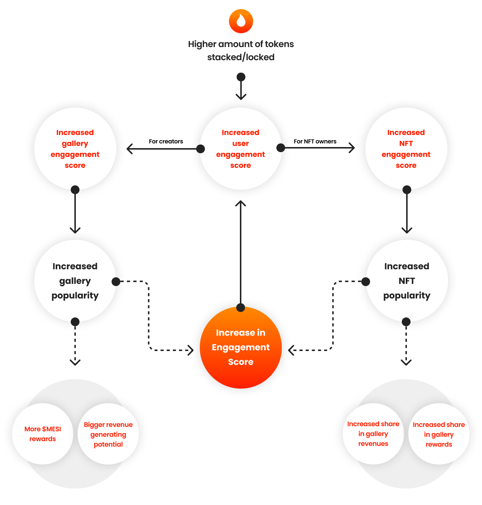

Mesi utilizes a "Contribution-First" reward model. Our system is designed to avoid the hyper-inflationary traps of traditional "passive staking," focusing instead on rewarding users who actively strengthen the platform’s social and economic layers.

## The "Indirect" Reward Philosophy

Most blockchain platforms provide direct token rewards just for holding or locking a balance. However, this often creates a cycle of increased sell pressure that devalues the token over time. 

**Mesi does not provide direct rewards for passive holding.** Instead, higher token balances and lockups grant you **Strategic Advantages**:

* **Increased Influence:** Higher balances generate more [Influence Points](/gamification/influence-points), allowing you to shape the platform’s trends.
* **Monetization Power:** Lockups unlock higher [Sales Thresholds](/path-to-thresholds) and better [AI Persona Features](/path-to-ai).
* **Visibility:** Influence Points delegated to your own gallery (or others) directly boost [Engagement Ratings](/path-to-engagement), leading to a higher share of the platform's revenue pool.

<Warning>
  **Sustainable Growth:** By focusing on indirect rewards, Mesi ensures that every $MESI token entering circulation is backed by actual platform utility and user activity, rather than arbitrary inflation.
</Warning>

---

## Active User Bonus

The **Active User Bonus** is the exclusive exception to our indirect rewards policy. This pool is specifically reserved for users who actively manage their Influence Points to support the creator community.

### How it Works
Rather than rewarding you for simply *having* points, we reward you for **allocating** them. 

<Card title="The Active Participation Pool" icon="users-rays">
  All users who have active [Influence Point allocations](/gamification/influence-points) periodically share a dedicated pool of $MESI rewards. 
  
  **Your Share** is calculated proportionally:
  $$\text{Your Reward} = \text{Total Pool} \times \frac{\text{Your Allocated Points}}{\text{Total Platform Allocated Points}}$$
</Card>

### Key Distribution Rules
* **Incentivized Curation:** This bonus encourages fans to become "curators," identifying and supporting the creators they believe deserve more visibility.
* **Dynamic Distribution:** The total size of the $MESI reward pool and the frequency of distribution are managed by the Mesi Treasury to ensure long-term economic stability.

<Frame caption="Monitoring your Active User Bonus and Influence impact">
  
</Frame>

---

## Summary: Participation vs. Passive Holding

| Feature | Passive Holding | Active Allocation |
| :--- | :--- | :--- |
| **Influence Points** | Generated | Generated |
| **Tier Access** | Included | Included |
| **$MESI Bonus Pool** | **Ineligible** | **Eligible** |
| **Ecosystem Impact** | Neutral | High (Boosts Creators) |

<Tip>
  **Maximize Your Returns:** To earn the highest possible yield on your $MESI, don't just hold your tokens. Set your [Withdrawal Limits](/gamification/user-tiers-and-creator-limits) to unlock points and delegate them to creators you support.
</Tip>
