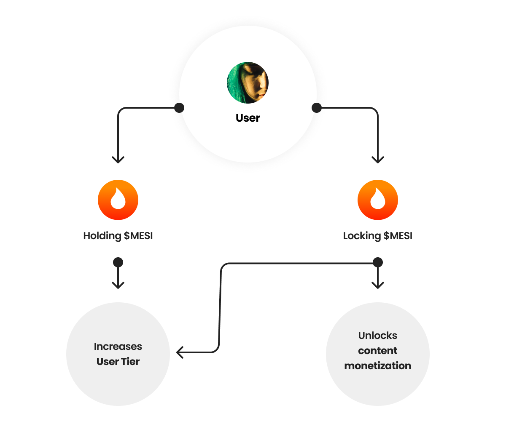

Mesi uses a dual-progression architecture to ensure platform security and creator accountability. By linking monetization capacity to token holdings, we create an environment where creators have "skin in the game."

<Frame caption="Managing your Token Lockups and Tier Progress">
  
</Frame>

## The Dual Progression Systems

<CardGroup cols={2}>
  <Card title="Content Monetization Limits" icon="money-bill-trend-up">
    Determines your maximum sales volume, number of active listings, and pricing ceilings. Progress is driven by **Locking $MESI tokens**.
  </Card>
  <Card title="User Tiers" icon="user-crown">
    Unlocks platform-wide benefits and social perks for both fans and creators. Progress is driven by your total **Influence Points** (a combination of holding and locking tokens).
  </Card>
</CardGroup>

For a detailed breakdown of specific values, see the [Incentives & Tier Limits](/path-to-tier-breakdown) section.

---

## Holding Score
The **Holding Score** is a dynamic metric representing the average $MESI balance in your wallet over a rolling **7-day window**.

Unlike other platforms that rely on occasional "snapshots," Mesi’s native chain monitors balances in real-time. Every transaction is factored into the moving average, providing an accurate representation of your platform investment.

> **Calculation Example:**
> * Days 1-5: 25,000 $MESI
> * Day 6: 10,000 $MESI
> * Day 7: 50,000 $MESI
> * **Holding Score:** 26,429

---

## The Lockup Mechanism

To "lock" tokens on Mesi, you simply set a **Withdrawal Limit** in your profile settings. This is a non-custodial process; tokens never leave your wallet.

<Frame caption="Visualizing the Tier Hierarchy">
  
</Frame>

### Adjusting Limits
* **Increasing Limits:** You can raise your withdrawal limit at any time to unlock higher tiers, maximize rewards, or boost your Engagement Score.
* **Decreasing Limits:** To regain access to locked tokens, you must first downgrade your account features (active sales, NFT listings) to match the requirements of the lower tier.

<Warning>
  **Locked Thresholds:** While tokens remain in your wallet, they cannot be spent or transferred if the transaction would cause your balance to fall below your set withdrawal limit.
</Warning>

### Why Lock Tokens?
The lockup system serves as a multi-purpose security layer:
1. **Authenticity:** Requires creators to maintain a financial stake, deterring bot accounts.
2. **Collateral:** Acts as a bond against policy violations, ensuring funds are available for fan compensation if rules are broken.
3. **Responsibility:** Scales monetization power with financial commitment, encouraging sustainable growth.

---

## Non-Custodial Security

Mesi is a **non-custodial** platform. You do not need to transfer your $MESI to a third-party vault or smart contract to increase your tier. 

* **Control:** You maintain 100% ownership and private key control over your tokens.
* **Transparency:** Your status is verified directly on the Creator Chain without the need for middle-man staking protocols.

---

## AI Persona Enhancements

Locking tokens provides direct technical upgrades to [AI Personas](/path-to-ai). As you reach higher tiers, your AI becomes more sophisticated:

* **Advanced Logic:** Deeper conversation trees and memory.
* **Emotional Intelligence:** Wider range of expressive responses.
* **Visual Fidelity:** Enhanced avatar rendering and animation quality.

<Tip>
  **The AI Advantage:** High-tier lockups transform a basic AI bot into a high-fidelity "Digital Twin" capable of advanced 1-on-1 fan interactions.
</Tip>
