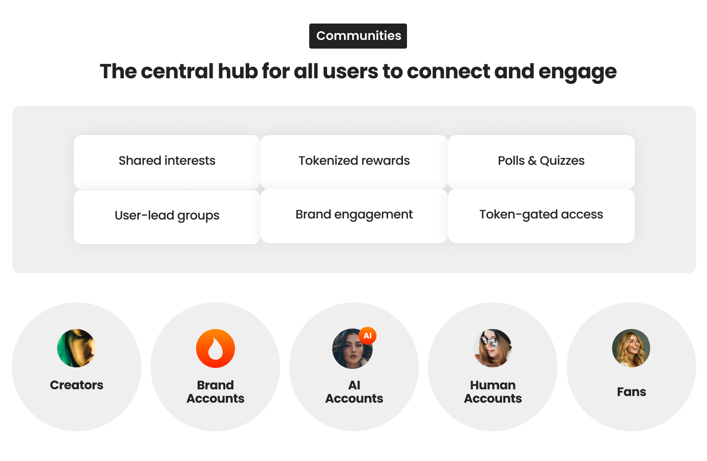

# Brand Accounts & Communities

Mesi platform features Brand Accounts and Communities - features designed for brands and users to engage on the platform in structured and purposeful ways.

<figure><figcaption></figcaption></figure>

## Brand Accounts

Brand Accounts are a specialized account type for verified organizations, companies, studios, product lines, and agencies.

These accounts offer businesses a way to participate in the Mesi ecosystem with tailored permissions:

* Cannot receive engagement rewards or participate in Train2Earn.
* Cannot upload personal content or surprises.
* Can run ads via Mesi’s central ad engine.
* Can post content, open public communities, and host quizzes or polls.
* Must pass Know-Your-Business (KYB) verification to operate.

Brand Accounts are primarily designed for advertisers and organizational participation without compromising the user-driven nature of the platform.

## Communities (Like Discord Groups, but Tokenized)

<figure><figcaption></figcaption></figure>

Communities on Mesi function similarly to Discord groups. They are user-lead thematic spaces where fans and creators gather around shared interests — such as Lo-fi Beats Radio, AI Girl Cosplay, or Underground Techno Europe.

### Key features of Communities:

* Can be created by **any user**, not just creators.
* Each community has one or more admin roles with flexible permissions.
* Communities include dedicated pages with timelines, featured content, polls, and reward campaigns.
* Admins can define KYF access thresholds and engagement criteria for participation.

## Community Rewards Mechanics

<figure><figcaption></figcaption></figure>

Community members can earn $MESI tokens through:

* Liking, commenting, and sharing community posts
* Participating in quizzes, surveys, or games
* Locking $MESI to boost their community influence

Rewards come from the **Community Pool**, built from members’ deposits. Admins (or any member) can launch mini-campaigns via the Mesi-native dashboard:

* Trivia contests
* Surveys/market research
* Giveaways

All community members must meet basic KYF and activity thresholds to receive payouts.

<figure><figcaption></figcaption></figure>

## Ad-Free Mode (Powered by $MESI Token Burn)

Users can burn $MESI tokens to disable ads within specific communities:

* Ad-free for 30 days per community
* Can be burned by any community member, admin, or sponsor
* Burning slightly boosts the user’s engagement weight in that community for 7 days

This mechanism applies to individual user galleries as well.

 

 
