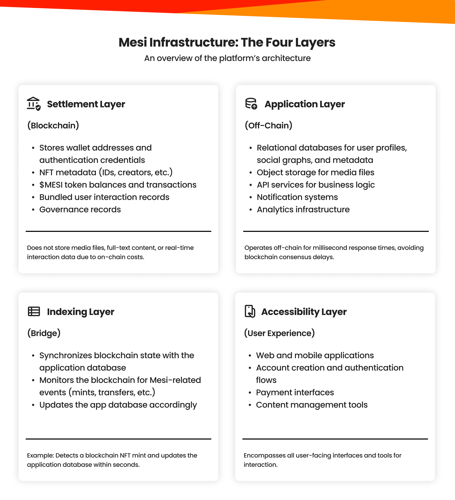

Mesi utilizes a high-performance blockchain environment designed for scalability, sub-second finality, and cost-efficiency. By leveraging an established Layer 1 or Layer 2 Proof of Stake (PoS) network, Mesi inherits robust security while focusing on rapid product innovation.

---

## System Architecture

Mesi’s infrastructure is categorized into four distinct layers, separating high-frequency application data from secure on-chain settlement.

<Frame caption="Mesi Four-Layer Infrastructure">
  
</Frame>

<CardGroup cols={2}>
  <Card title="Settlement Layer" icon="link">
    **On-Chain (Blockchain)**
    Handles smart contracts, **\$MESI** balances, NFT metadata hashes, and governance records.
  </Card>
  <Card title="Indexing Layer" icon="bridge">
    **The Bridge**
    Synchronizes blockchain states with the application database, monitoring for events like NFT mints or transfers.
  </Card>
  <Card title="Application Layer" icon="server">
    **Off-Chain**
    Handles heavy computation, media storage (object storage), and API services for millisecond response times.
  </Card>
  <Card title="Accessibility Layer" icon="mobile-screen-button">
    **User Experience**
    The front-end web and mobile interfaces, authentication flows, and content management tools.
  </Card>
</CardGroup>

---

## Progressive Decentralization Roadmap

Mesi follows a staged approach to decentralizing its infrastructure, ensuring platform stability before transitioning control to the community.

<Steps>
  <Step title="Stage 1: Decentralized Application Layer">
    Opening the off-chain infrastructure (API services and storage nodes) to third-party operators.
  </Step>
  <Step title="Stage 2: Decentralized Indexing">
    Transitioning the bridge between on-chain and off-chain data to a distributed indexing protocol.
  </Step>
  <Step title="Stage 3: Decentralized Settlement">
    Launching the native Mesi Creator Chain, where node operators who stake **\$MESI** tokens validate and settle all on-chain transactions.
  </Step>
</Steps>

---

## Gasless Experience & Account Abstraction

Mesi removes the "crypto barrier" by abstracting blockchain complexities away from the end-user.

* **Smart Contract Wallets:** Every user receives a wallet automatically upon signup (social login via Google/Apple).
* **Sponsored Gas:** Mesi covers gas fees for standard actions (posting, tipping, minting) up to a monthly limit.
* **Flexible Overages:** Once limits are reached, users can pay fees in **\$MESI** (automatically converted) or switch to full self-custody.

---

## Content Ownership & Privacy

Mesi balances the **permanence** of blockchain with the **privacy** requirements of modern data laws (GDPR).

### The Upload Process
1.  **Storage:** Media is stored in globally distributed cloud object storage.
2.  **Hashing:** A unique cryptographic hash is generated for the file.
3.  **Minting:** An NFT is minted on-chain containing the hash and licensing terms.
4.  **Provenance:** Ownership is permanently recorded in the creator's wallet.

### Content Removal & Rights
Users retain the right to delete media files or hide them. While the media file is removed from the delivery network, the **NFT record and its hash remain on the blockchain** as a permanent, immutable proof of historical creation and provenance.

---

## Privacy & Zero-Knowledge Proofs (ZKP)

Mesi implements Zero-Knowledge technologies to protect user identities while maintaining a verifiable ecosystem.

* **Public Data:** Wallet addresses, NFT ownership, and transaction histories.
* **Private Data:** Real-world identities, social connections, and engagement metrics.
* **ZKP Utility:** Allows the platform to verify user credentials or age-gates without the user needing to reveal the underlying private data.

<Note>
  **Node Operator Program:** As Mesi moves into Phase 3, community members will be able to stake **\$MESI** to operate nodes, earning rewards for providing the computational power that fuels the Creator Chain.
</Note>

<Tip>
  **For Developers:** Mesi’s indexing layer provides a GraphQL-based API for querying on-chain creator data with near-zero latency.
</Tip>
